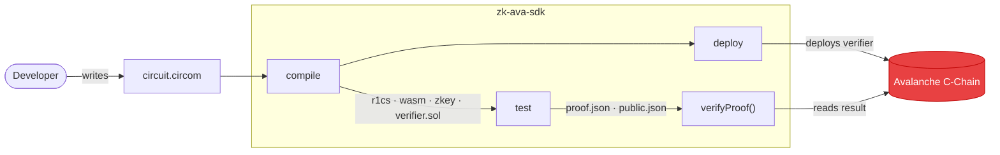

# Introduction

> **Write Circom. Compile. Deploy. Verify — all in just one click, powered by Avalanche.**

**`zk-ava-sdk`** is a zero-setup toolkit that takes a [Circom](https://docs.circom.io/)
circuit all the way from source code to an on-chain, verifiable zero-knowledge proof on
the [Avalanche](https://www.avax.network/) C-Chain — without forcing you to learn
`snarkjs`, `solc`, ABIs, or web3 plumbing.

You write a circuit. The SDK compiles it, runs the Groth16 trusted setup, generates a
Solidity verifier, deploys that verifier to Avalanche, and lets you verify proofs against
it with a single function call.

## Why it exists

Building a production ZK application normally means stitching together a half-dozen tools
and getting every step exactly right:

* Install and configure the Circom compiler.
* Source the right Powers of Tau file and run the Groth16 setup.
* Export a Solidity verifier with `snarkjs`.
* Compile that verifier with the correct `solc` version.
* Deploy it to a chain with web3, managing gas and keys by hand.
* Format proof calldata correctly (including the notorious G2 point byte-ordering swap).

`zk-ava-sdk` collapses all of that into **four commands and one function**.

## Features

* 🧠 **Write simple Circom circuits** — focus on your logic, not tooling.
* 🛠 **One-command compile** to `.r1cs`, `.wasm`, `.zkey`, and a Solidity `verifier.sol`.
* 🚀 **One-command deploy** of the verifier to Avalanche (Fuji testnet by default, C-Chain mainnet with a flag).
* ✅ **One-function verification** of proofs against the deployed contract.
* 📦 **Batteries included** — bundles the `circom` binary, `circomlib`, and a Powers of Tau file. No global installs.
* 🧪 **No Web3 scripting** — no manual ABI handling, no calldata formatting, no RPC wiring.

## How it fits together

## Who this is for

* **Smart-contract & dApp developers** who want on-chain ZK verification without becoming
  cryptography or tooling experts.
* **Hackathon teams** who need to ship a working ZK proof of concept on Avalanche fast.
* **Learners** exploring zero-knowledge proofs end to end, from circuit to chain.

## Where to go next

| If you want to…                                  | Start here |
| ------------------------------------------------ | ---------- |
| Get something working in five minutes            | [Quick Start](getting-started/quick-start.md) |
| Understand the cryptography first                | [Zero-Knowledge Proofs](concepts/zero-knowledge-proofs.md) |
| See how the SDK is built                         | [System Overview](architecture/overview.md) |
| Look up a specific command                       | [CLI Reference](cli/overview.md) |
| Verify proofs from your own code                 | [verifyProof](api/verify-proof.md) |


**New to zero-knowledge proofs?** Read the [Core Concepts](concepts/zero-knowledge-proofs.md)
section first — it explains every term used throughout these docs in plain language.

