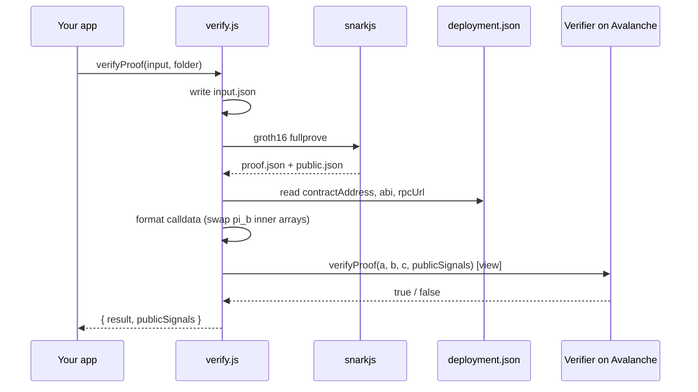

# `verifyProof`

The function you call from your own application to **verify a proof on-chain**. It
regenerates a proof from your input, then checks it against the deployed verifier contract
on Avalanche — abstracting away proof generation, calldata formatting, and web3 entirely.

## Import

```js
const { verifyProof } = require("zk-ava-sdk");
```

## Signature

```js
const { result, publicSignals } = await verifyProof(input, folderPath);
```

| Parameter | Type | Description |
| --------- | ---- | ----------- |
| `input` | `object` | The circuit inputs, e.g. `{ a: 3, b: 11 }`. Written to `input.json` and used to generate the proof. |
| `folderPath` | `string` | Path to the circuit folder produced by `compile` (and deployed with `deploy`). |

### Returns

A promise resolving to:

```js
{
  result: Boolean,        // true if the proof is valid on-chain
  publicSignals: String[] // the circuit's public signals
}
```

On failure it logs the error and rethrows, so wrap calls in `try/catch`.

## Example

```js
const { verifyProof } = require("zk-ava-sdk");

(async () => {
  try {
    const { result, publicSignals } = await verifyProof(
      { a: 3, b: 11 },
      "./multiplier"
    );

    console.log("Public signals:", publicSignals);
    console.log(result ? "✅ Valid proof" : "❌ Invalid proof");
  } catch (err) {
    console.error("Verification error:", err.message);
  }
})();
```

## What it does, step by step

1. **Writes `input.json`** into the folder from your `input` object.
2. **Generates a proof** with `snarkjs groth16 fullprove`, producing `proof.json` and
   `public.json`.
3. **Reads `deployment.json`** to get the contract address, ABI, network, and RPC URL.
   (If `rpcUrl` is absent, it falls back to the URL implied by `network`.)
4. **Formats the calldata** — including reversing the inner arrays of `pi_b` (the G2 point)
   to match the Solidity verifier.
5. **Calls** `verifyProof(pi_a, pi_b, pi_c, publicSignals)` on the contract as a `view`
   call (no gas) and returns the result.

## Sequence



## The `pi_b` swap

The single most error-prone part of calling a Groth16 verifier by hand is the G2 point
(`pi_b`) coordinate ordering. `verifyProof` does it for you:

```js
const pi_b = [
  [proof.pi_b[0][1], proof.pi_b[0][0]],  // inner arrays reversed
  [proof.pi_b[1][1], proof.pi_b[1][0]],
];
```

`pi_a` and `pi_c` are passed through unchanged (only their first two elements). For the
full explanation and a before/after, see [Proof Calldata Format](../reference/calldata.md).

## Prerequisites & gotchas

* The folder must have been **compiled** (`.wasm`, `circuit_final.zkey`) and **deployed**
  (`deployment.json` present). Missing `deployment.json` throws
  `deployment.json not found in <folder>`.
* `verifyProof` **regenerates** the proof every call from the `input` you pass — it does not
  reuse a stale `proof.json`. Pass the input you actually want to prove.
* The call is read-only (`.call()`), so verification itself costs no gas.

## Next

* See the other exported functions → [Library Exports](library-exports.md)
* Wire this into a frontend or contract → [Integrating Verification into a dApp](../guides/dapp-integration.md)
