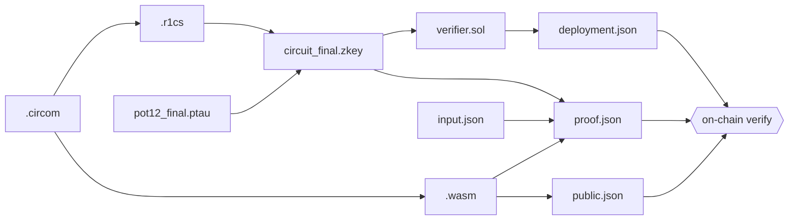

# Generated Artifacts

Every file the SDK produces, what it's for, which command creates it, and which consumes
it. All artifacts live inside the **circuit folder** — a directory named after your circuit
(e.g. `./multiplier/`), created by `compile`.

## The circuit folder

```
multiplier/
├── multiplier.r1cs          # constraint system
├── multiplier_js/
│   └── multiplier.wasm      # witness calculator
├── circuit_final.zkey       # proving / verification key
├── verifier.sol             # Solidity verifier source
├── input.json               # last input (written by verifyProof)
├── proof.json               # the proof (calldata)
├── public.json              # public signals
└── deployment.json          # deployed contract address, ABI, network
```


The `.wasm` lives under `<circuitName>_js/<circuitName>.wasm`, and the proving key is always
named `circuit_final.zkey` regardless of circuit name. The `test` and `verifyProof` code
rely on exactly these paths.


## Artifact reference

| File | What it is | Created by | Consumed by |
| ---- | ---------- | ---------- | ----------- |
| `<name>.r1cs` | The Rank-1 Constraint System — your circuit's constraints. | `compile` | `compile` (Groth16 setup) |
| `<name>_js/<name>.wasm` | WebAssembly witness calculator — computes all signal values from inputs. | `compile` | `test`, `verifyProof` |
| `circuit_final.zkey` | Groth16 proving & verification key for this circuit. | `compile` | `test`, `verifyProof`, verifier export |
| `verifier.sol` | Solidity contract that verifies proofs for this circuit. | `compile` | `deploy` |
| `input.json` | The circuit inputs used for proof generation. | you (for `test`); `verifyProof` writes it automatically | `test`, `verifyProof` |
| `proof.json` | The Groth16 proof: `pi_a`, `pi_b`, `pi_c`. The on-chain calldata. | `test`, `verifyProof` | `verifyProof` |
| `public.json` | The public signals (circuit outputs). Human-verifiable. | `test`, `verifyProof` | `verifyProof`, your dApp |
| `deployment.json` | `{ contractAddress, abi, network, rpcUrl }` of the deployed verifier. | `deploy` | `verifyProof`, your dApp |

## Dependency graph



## A note on `proof.json`

`proof.json` contains the three proof points that become the smart-contract parameters.
`public.json` contains the public signals — the human-verifiable outputs. Before the proof
is sent on-chain, the SDK reverses the inner arrays of `pi_b` (the G2 point) to match what
the Solidity verifier expects. See [Proof Calldata Format](../reference/calldata.md).

## A note on `deployment.json`

This file is the link between off-chain proving and on-chain verification. Because it
stores the network and RPC URL alongside the address and ABI, `verifyProof()` automatically
targets the correct network — you never pass an address or RPC URL by hand. Keep it in your
circuit folder; treat it as the source of truth for "where is my verifier deployed."
