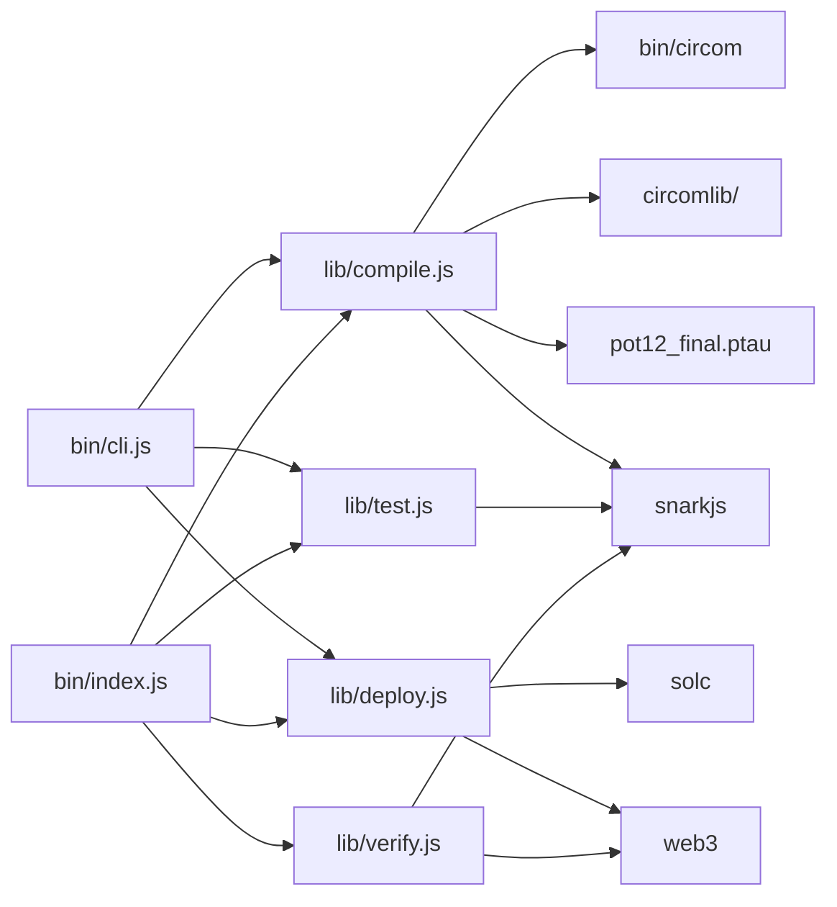

# Components

A file-by-file map of the SDK. Paths are relative to the package root.

## Entry points — `bin/`

### `bin/cli.js`

The command-line interface, built with `commander`. It registers three commands and wires
each to its core module:

| Command | Arguments | Calls |
| ------- | --------- | ----- |
| `compile` | `<circomFilePath>` | `compileCircuit()` |
| `test` | `<folder> <inputJson>` | `testCircuit()` |
| `deploy` | `<folder> <privateKey>` `--mainnet` | `deployVerifier(folder, key, { mainnet })` |

It also re-exports `verifyProof` so the package's `bin` entry can expose it.

### `bin/index.js`

The library entry point referenced by `package.json`'s `main` field. It re-exports all
four functions for programmatic use:

```js
module.exports = { verifyProof, compileCircuit, testCircuit, deployVerifier };
```

### `bin/circom`

The bundled **Circom compiler binary** (~10 MB). `compile.js` invokes it directly so users
don't need Circom installed globally.

## Core logic — `lib/`

### `lib/compile.js`

Orchestrates the full build:

1. Derives an output folder from the circuit's base name and clears it.
2. Resolves and validates the bundled `circomlib/circuits` include path.
3. Runs the bundled `circom` with `--wasm --r1cs -l <circomlib>`.
4. Verifies the `.r1cs` was produced, then runs `snarkjs groth16 setup` with
   `pot12_final.ptau`.
5. Exports `verifier.sol` via `snarkjs zkey export solidityverifier`.

### `lib/test.js`

Validates the folder, input, `.wasm`, and `.zkey` exist, then runs
`snarkjs groth16 fullprove` to produce `proof.json` and `public.json`.

### `lib/deploy.js`

Reads `verifier.sol`, compiles it with `solc` (selecting the contract that `solc` emits),
extracts the ABI and bytecode, then uses `web3` to deploy to Avalanche — Fuji by default,
mainnet when `{ mainnet: true }`. Writes `deployment.json` with the address, ABI, network,
and RPC URL.

### `lib/verify.js`

Writes the input to `input.json`, regenerates the proof with `snarkjs groth16 fullprove`,
reads `proof.json` + `public.json` + `deployment.json`, formats the calldata (including the
[G2 `pi_b` swap](../reference/calldata.md)), and calls `verifyProof(...)` on the deployed
contract via `web3`. Returns `{ result, publicSignals }`.

## Bundled assets

| Path | What it is |
| ---- | ---------- |
| `circomlib/` | The standard Circom component library, used as the `-l` include path. |
| `ptau/pot12_final.ptau` | The Powers of Tau file consumed by the Groth16 setup. |
| `pot12_0000.ptau`, `pot12_0001.ptau` | Intermediate Powers of Tau contribution files. |

## Dependency map



For the runtime flow that ties these together, see
[End-to-End Lifecycle](lifecycle.md).
