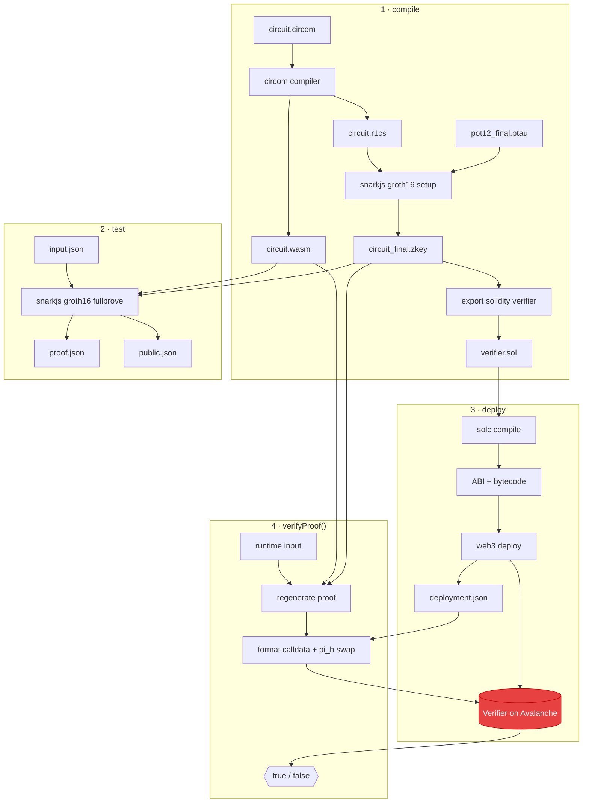

# End-to-End Lifecycle

This page traces a circuit through the **entire pipeline** — from `.circom` source to a
proof verified on Avalanche — showing what each stage consumes and produces.

## The full pipeline

## Stage by stage

### 1. Compile (`lib/compile.js`)

**In:** `circuit.circom` · **Out:** `circuit.r1cs`, `circuit.wasm`, `circuit_final.zkey`,
`verifier.sol`

The circuit is compiled to its constraint system (`.r1cs`) and witness calculator
(`.wasm`). The Groth16 setup binds the universal `pot12_final.ptau` to this circuit,
producing `circuit_final.zkey`, from which the Solidity verifier is exported. → [compile](../cli/compile.md)

### 2. Test (`lib/test.js`)

**In:** `input.json`, `.wasm`, `.zkey` · **Out:** `proof.json`, `public.json`

`fullprove` computes the witness from your inputs and generates a Groth16 proof in one
step. `proof.json` holds the proof points; `public.json` holds the public signals. → [test](../cli/test.md)

### 3. Deploy (`lib/deploy.js`)

**In:** `verifier.sol`, a private key · **Out:** deployed contract, `deployment.json`

`verifier.sol` is compiled with `solc` and deployed to Avalanche with `web3`. The address,
ABI, network, and RPC URL are saved so later verification needs no manual configuration. → [deploy](../cli/deploy.md)

### 4. Verify (`lib/verify.js`)

**In:** runtime input, `deployment.json`, `.wasm`, `.zkey` · **Out:** `{ result, publicSignals }`

`verifyProof()` regenerates a proof from fresh input, formats the calldata (with the G2
`pi_b` swap), and calls the deployed verifier as a `view` call — returning whether the
proof is valid. → [verifyProof](../api/verify-proof.md)

## Artifact handoff summary

| Stage | Reads | Writes |
| ----- | ----- | ------ |
| compile | `.circom`, `pot12_final.ptau` | `.r1cs`, `.wasm`, `.zkey`, `verifier.sol` |
| test | `.wasm`, `.zkey`, `input.json` | `proof.json`, `public.json` |
| deploy | `verifier.sol` | `deployment.json` (+ on-chain contract) |
| verifyProof | `.wasm`, `.zkey`, `deployment.json` | `input.json`, `proof.json`, `public.json` (regenerated) |

Each artifact is detailed in [Generated Artifacts](artifacts.md).
