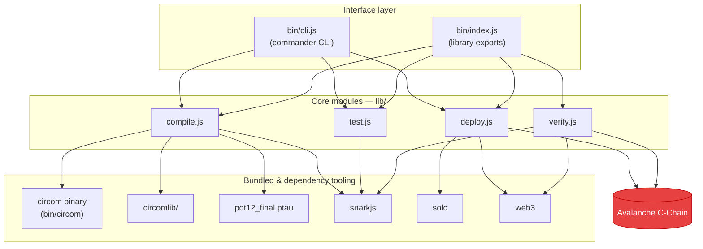

# System Overview

`zk-ava-sdk` is a thin, well-defined orchestration layer over established ZK and EVM
tooling. It does not reimplement cryptography — it **wires together** the right tools in
the right order and hides the friction.

## Layered architecture

## The two entry points

The SDK is usable in two ways, both backed by the same four core modules:

* **CLI** (`bin/cli.js`) — exposes `compile`, `test`, and `deploy` as terminal commands
  via [commander](https://github.com/tj/commander.js). This is the path most people use to
  build and ship.
* **Library** (`bin/index.js`) — exports `compileCircuit`, `testCircuit`,
  `deployVerifier`, and `verifyProof` for programmatic use. The on-chain `verifyProof` is
  the function you call from your own app.


Note the deliberate split: **proof verification is library-only**, not a CLI command.
Verifying a proof is something your application does at runtime, so it's exposed as a
function. See [verifyProof](../api/verify-proof.md).


## The four core modules

| Module | Responsibility | Key tools used |
| ------ | -------------- | -------------- |
| `lib/compile.js` | Circuit → R1CS/WASM, Groth16 setup, export verifier | `circom`, `circomlib`, `pot12_final.ptau`, `snarkjs` |
| `lib/test.js` | Generate a proof from inputs | `snarkjs groth16 fullprove` |
| `lib/deploy.js` | Compile & deploy `verifier.sol` to Avalanche | `solc`, `web3` |
| `lib/verify.js` | Generate a proof and verify it on-chain | `snarkjs`, `web3` |

## Design principles

* **Zero-setup** — heavyweight tooling (`circom`, `circomlib`, a Powers of Tau file) is
  bundled so users don't manage it.
* **Convention over configuration** — outputs always go to a folder named after the
  circuit; the proof, verifier, and deployment info live together; `verifyProof()` finds
  everything by convention.
* **Stateful by file** — each step persists what the next step needs (`circuit_final.zkey`,
  `proof.json`, `deployment.json`), so steps are independent and resumable.

See [Components](components.md) for a file-by-file breakdown, or
[End-to-End Lifecycle](lifecycle.md) for how data flows through the whole pipeline.
