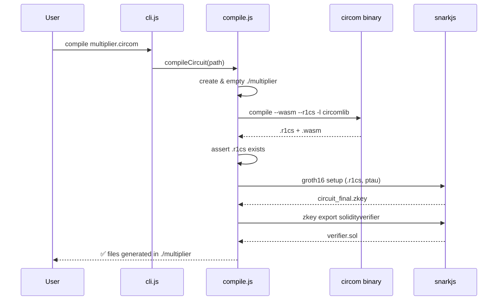

# `compile`

Compile a Circom circuit, run the Groth16 trusted setup, and export a Solidity verifier —
all in one command.

## Synopsis

```bash
npx zk-ava-sdk compile <circomFilePath>
```

## Arguments

| Argument | Required | Description |
| -------- | -------- | ----------- |
| `<circomFilePath>` | yes | Path to your `.circom` source file. |

## What it does

```bash
npx zk-ava-sdk compile multiplier.circom
```

1. **Creates an output folder** named after the circuit's base name (e.g. `./multiplier/`)
   and empties it if it already exists.
2. **Compiles the circuit** with the bundled `circom` binary, using `circomlib` as the
   include path:
   ```
   circom multiplier.circom --wasm --r1cs -l <circomlib/circuits> -o ./multiplier
   ```
3. **Runs the Groth16 setup** with the bundled Powers of Tau file:
   ```
   snarkjs groth16 setup multiplier.r1cs pot12_final.ptau circuit_final.zkey
   ```
4. **Exports the Solidity verifier**:
   ```
   snarkjs zkey export solidityverifier circuit_final.zkey verifier.sol
   ```

## Outputs

Inside `./<circuitName>/`:

| File | Description |
| ---- | ----------- |
| `<name>.r1cs` | The constraint system. |
| `<name>_js/<name>.wasm` | The witness calculator. |
| `circuit_final.zkey` | The Groth16 proving/verification key. |
| `verifier.sol` | The Solidity verifier, ready to deploy. |

## Sequence



## Example

```bash
$ npx zk-ava-sdk compile multiplier.circom
📦 Compiling multiplier into /path/to/multiplier...
✅ All files successfully generated in: /path/to/multiplier
```

## Common errors

| Message | Cause | Fix |
| ------- | ----- | --- |
| `❌ Circomlib not found at: ...` | The bundled `circomlib/circuits` path is missing. | Reinstall the package; don't strip bundled folders. |
| `❌ Compilation failed: <name>.r1cs not found.` | The circuit didn't compile (syntax error, missing `main`, bad include). | Check the circom output above the error; fix the circuit. |
| `❌ Missing PTAU file at: ...` | `ptau/pot12_final.ptau` is absent. | Reinstall the package. |
| Constraint count exceeds setup size | Circuit is larger than `2^12` constraints. | Reduce the circuit, or supply a larger ptau — see [Constraint Limits & PTAU](../reference/constraints-ptau.md). |

## Next

* Generate a proof → [test](test.md)
* Understand what you produced → [Generated Artifacts](../architecture/artifacts.md)
