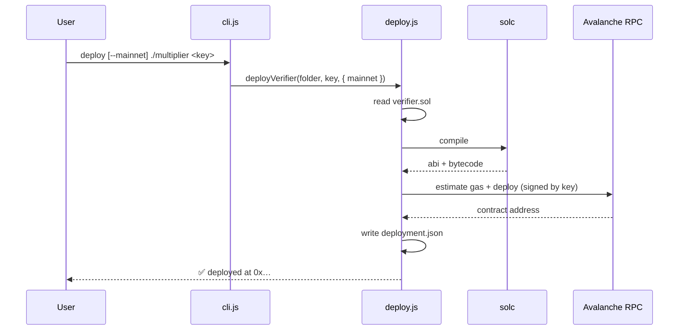

# `deploy`

Compile the generated `verifier.sol` and deploy it to the Avalanche C-Chain — Fuji testnet
by default, or mainnet with a flag.

## Synopsis

```bash
npx zk-ava-sdk deploy <folder> <privateKey>
npx zk-ava-sdk deploy --mainnet <folder> <privateKey>
```

## Arguments & options

| Argument / option | Required | Description |
| ----------------- | -------- | ----------- |
| `<folder>` | yes | The circuit folder containing `verifier.sol`. |
| `<privateKey>` | yes | The private key of the wallet that pays gas for deployment. |
| `--mainnet` | no | Deploy to Avalanche **C-Chain mainnet** instead of Fuji testnet. |


The private key is passed as a plain CLI argument and pays real gas. **Never commit it,
never paste it into shared machines or screenshots, and prefer reading it from an
environment variable.** See [Security Considerations](../help/security.md).


## What it does

1. Reads `verifier.sol` from the folder.
2. Compiles it with `solc`, selecting the contract `solc` emits, and extracts its **ABI**
   and **bytecode**.
3. Connects to the target Avalanche RPC and loads the wallet from the private key.
4. Estimates gas and **deploys** the contract.
5. Writes `deployment.json` with the address, ABI, network, and RPC URL.

## Networks

| Mode | Flag | RPC URL |
| ---- | ---- | ------- |
| Fuji testnet | _(default)_ | `https://api.avax-test.network/ext/bc/C/rpc` |
| C-Chain mainnet | `--mainnet` | `https://api.avax.network/ext/bc/C/rpc` |

The chosen `network` and `rpcUrl` are persisted to `deployment.json` so that
[`verifyProof()`](../api/verify-proof.md) automatically targets the right network. See
[Network & RPC Details](../reference/networks.md).

## Outputs

`deployment.json` in the circuit folder:

```json
{
  "contractAddress": "0x…",
  "abi": [ /* verifier ABI */ ],
  "network": "fuji",
  "rpcUrl": "https://api.avax-test.network/ext/bc/C/rpc"
}
```

## Sequence



## Example

```bash
$ npx zk-ava-sdk deploy ./multiplier $PRIVATE_KEY
✅ Contract deployed on Avalanche fuji!
📦 Contract Address: 0xAbC...123
```

## Common errors

| Message | Cause | Fix |
| ------- | ----- | --- |
| `❌ verifier.sol not found in folder: ...` | The folder wasn't compiled. | Run [`compile`](compile.md) first. |
| `Compilation failed, no bytecode found.` | `solc` couldn't compile the verifier. | Re-export the verifier via `compile`; check `solc` version compatibility. |
| `insufficient funds` / gas errors | Wallet has no AVAX on the target network. | Fund the wallet; use the [Fuji faucet](https://faucet.avax.network/) for testnet. |
| `invalid private key` | Malformed key. | Provide a valid hex private key (with or without `0x` per web3 rules). |

## Next

* Verify proofs against this contract → [verifyProof](../api/verify-proof.md)
* Go to production → [Deploying to Mainnet](../guides/mainnet.md)
