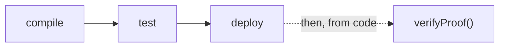

# CLI Reference — Overview

The `zk-ava-sdk` command-line interface is built with
[commander](https://github.com/tj/commander.js) and exposes three commands. Run them with
`npx`:

```bash
npx zk-ava-sdk <command> [arguments] [options]
```

## Commands at a glance

| Command | Synopsis | Purpose |
| ------- | -------- | ------- |
| [`compile`](compile.md) | `compile <circomFilePath>` | Compile a circuit, run the trusted setup, export a verifier. |
| [`test`](test.md) | `test <folder> <inputJson>` | Generate a proof and public signals from inputs. |
| [`deploy`](deploy.md) | `deploy [--mainnet] <folder> <privateKey>` | Compile and deploy the verifier to Avalanche. |


**Proof verification is not a CLI command.** It runs at your application's runtime, so it's
exposed as the [`verifyProof()`](../api/verify-proof.md) library function instead.


## The convention: a folder per circuit

The CLI is built around one organizing convention: **`compile` creates a folder named
after your circuit**, and every later command operates on that folder.

```bash
npx zk-ava-sdk compile multiplier.circom   # creates ./multiplier/
npx zk-ava-sdk test ./multiplier ./input.json
npx zk-ava-sdk deploy ./multiplier <KEY>
```

All artifacts — `.r1cs`, `.wasm`, `.zkey`, `verifier.sol`, `proof.json`, `public.json`,
`deployment.json` — live together in that one folder. See
[Generated Artifacts](../architecture/artifacts.md).

## Typical order



1. **`compile`** once per circuit (re-run if you change the circuit).
2. **`test`** to confirm your inputs produce a valid proof.
3. **`deploy`** once to put the verifier on-chain.
4. **`verifyProof()`** from your application, as often as you like.

## Getting help

```bash
npx zk-ava-sdk --help            # list all commands
npx zk-ava-sdk deploy --help     # help for a specific command
```

Continue to the individual command pages for full details, sequence diagrams, and common
errors.
