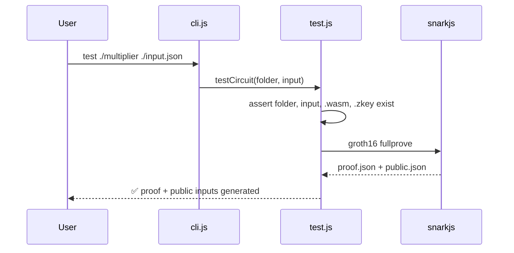

# `test`

Generate a zero-knowledge proof from your circuit and a set of inputs. This is how you
confirm — locally — that your inputs produce a valid proof before deploying anything.

## Synopsis

```bash
npx zk-ava-sdk test <folder> <inputJson>
```

## Arguments

| Argument | Required | Description |
| -------- | -------- | ----------- |
| `<folder>` | yes | The circuit folder produced by [`compile`](compile.md), e.g. `./multiplier`. |
| `<inputJson>` | yes | Path to a JSON file with values for the circuit's input signals. |

## Input file format

The input JSON maps each circuit input signal to a value. For the multiplier circuit:

```json
{ "a": 3, "b": 11 }
```

## What it does

Under the hood it runs a single `snarkjs` command that computes the witness and generates
the proof together:

```
snarkjs groth16 fullprove <input.json> <wasm> <circuit_final.zkey> proof.json public.json
```

It locates the `.wasm` at `<folder>/<folderName>_js/<folderName>.wasm` and the proving key
at `<folder>/circuit_final.zkey`.

## Outputs

Inside the circuit folder:

| File | Description |
| ---- | ----------- |
| `proof.json` | The Groth16 proof (`pi_a`, `pi_b`, `pi_c`) — the smart-contract calldata. |
| `public.json` | The public signals (circuit outputs) — human-verifiable. |

## Sequence



## Example

```bash
$ npx zk-ava-sdk test ./multiplier ./input.json
✅ Running groth16 fullprove...
✅ Proof generated at: ./multiplier/proof.json
✅ Public inputs at: ./multiplier/public.json
```

## Common errors

| Message | Cause | Fix |
| ------- | ----- | --- |
| `❌ Folder not found: ...` | The circuit folder path is wrong. | Pass the folder created by `compile`. |
| `❌ input.json not found: ...` | The input path is wrong. | Check the path to your input JSON. |
| `❌ .wasm file not found: ...` | The folder wasn't compiled, or its name doesn't match. | Re-run `compile`; keep the folder name unchanged. |
| `❌ circuit_final.zkey not found...` | Compilation didn't finish. | Re-run `compile` first. |
| Errors from `fullprove` about inputs | Missing/extra input signals, or values that violate constraints. | Make the input JSON match the circuit's input signals exactly. |


`test` only proves locally. It does **not** touch the blockchain. To check a proof against
the deployed contract, deploy with [`deploy`](deploy.md) and call
[`verifyProof()`](../api/verify-proof.md).


## Next

* Put the verifier on-chain → [deploy](deploy.md)
