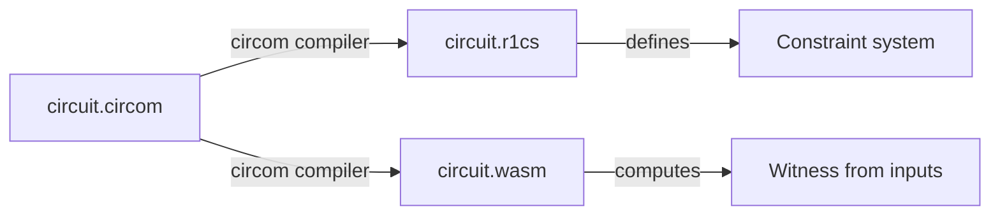

# Circom & Circuits

[Circom](https://docs.circom.io/) is the language you write your ZK logic in. This page is
a quick primer on the concepts you'll meet when using `zk-ava-sdk`.

## What is a circuit?

A ZK "circuit" is an **arithmetic circuit**: a set of constraints over a finite field that
your inputs must satisfy. Circom is a domain-specific language for describing those
constraints, which it compiles into an **R1CS** (Rank-1 Constraint System).

## The building blocks

### Signals

Signals are the variables of a circuit. They come in three flavors:

```circom
signal input a;    // provided by the prover
signal output c;   // revealed as a public signal
signal x;          // intermediate (internal) signal
```

By default, `input` signals are **private** and `output` signals are **public**. This is
the public/private split described in [Zero-Knowledge Proofs](zero-knowledge-proofs.md).

### Constraints

Constraints define the relationships signals must satisfy. The `<==` operator both
**assigns** a value and **adds a constraint**:

```circom
c <== a * b;   // assign c = a*b AND constrain it
```

Circom enforces that every constraint is **rank-1**: at most one multiplication of signals
per constraint. (`c <== a * b` is fine; `c <== a * b * d` is not — you'd split it.)

### Templates and components

Templates are reusable, parameterizable circuit definitions. You instantiate them as
components:

```circom
template Multiplier() {
    signal input a;
    signal input b;
    signal output c;
    c <== a * b;
}

component main = Multiplier();   // entry point
```

Every circuit needs a `main` component — that's the top-level circuit the SDK compiles.

## A complete minimal circuit

```circom
pragma circom 2.0.0;

template Multiplier() {
    signal input a;
    signal input b;
    signal output c;
    c <== a * b;
}

component main = Multiplier();
```

## circomlib — the standard library

You rarely build cryptographic primitives from scratch. `zk-ava-sdk` bundles
[**circomlib**](https://github.com/iden3/circomlib), a library of audited components —
Poseidon and MiMC hashes, comparators, bit decomposition, EdDSA, and more.

The SDK passes circomlib as an include path (`-l`) during compilation, so you can simply:

```circom
include "poseidon.circom";
```

See the [Using circomlib Components](../guides/circomlib.md) guide for examples.

## From source to proof

When you `compile`, Circom produces two key outputs:



* **`.r1cs`** — the constraint system, consumed by the Groth16 setup.
* **`.wasm`** — a WebAssembly program that computes the **witness** (all signal values)
  from your inputs during proof generation.

## The finite field

All Circom arithmetic happens modulo a large prime (the BN254 curve's scalar field). This
has practical consequences: there's no native "less than" on raw field elements, numbers
wrap around, and operations like comparison or bit manipulation require dedicated
circomlib components. Keep this in mind when your circuit logic involves ranges or
inequalities.

Next: how the generated verifier checks proofs on-chain →
[On-chain Verification](onchain-verification.md).
