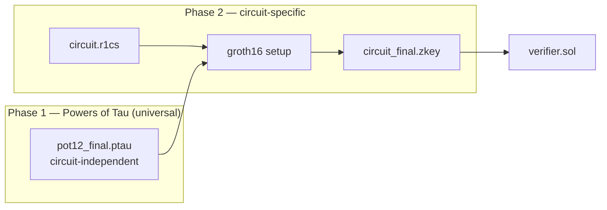

# Groth16 & Trusted Setup

`zk-ava-sdk` uses the **Groth16** proving system. This page explains what that means and
why a "trusted setup" is part of the workflow.

## What is Groth16?

Groth16 (introduced by Jens Groth in 2016) is a zk-SNARK construction prized for:

* **Tiny proofs** — three elliptic-curve points (`pi_a`, `pi_b`, `pi_c`), only a few
  hundred bytes.
* **Cheap, constant-time verification** — a fixed handful of elliptic-curve pairings,
  regardless of circuit size. This is what makes on-chain verification affordable.

The trade-off: Groth16 requires a **trusted setup** that is *circuit-specific*.

## Why a trusted setup?

Groth16 needs a set of public parameters (the *proving key* and *verification key*)
derived from secret random values. Those secret values — collectively the **"toxic
waste"** — must be destroyed. If anyone retains them, they could forge proofs that pass
verification. They cannot, however, break zero-knowledge (your witness stays private).

The setup happens in two phases:



### Phase 1 — Powers of Tau

A **universal**, circuit-independent ceremony. Its output is a `.ptau` file that can be
reused for *any* circuit up to a certain size. `zk-ava-sdk` **bundles** one:
`ptau/pot12_final.ptau`.

### Phase 2 — circuit-specific setup

This binds the universal parameters to *your* specific circuit. The SDK runs it for you
during `compile`:

```
snarkjs groth16 setup circuit.r1cs pot12_final.ptau circuit_final.zkey
```

The result is `circuit_final.zkey` — the proving/verification key for your circuit — from
which the Solidity verifier is exported.

## What "pot12" means

The bundled file is `pot12_final.ptau`. The **12** is the power of two:

$$2^{12} = 4096$$

This caps the circuit at roughly **4,096 constraints**. Most simple circuits (hashes,
comparisons, small arithmetic) fit comfortably; large circuits do not. See
[Constraint Limits & PTAU](../reference/constraints-ptau.md) for how to reason about this.

## The trust assumption of the bundled ptau

Because the SDK ships a pre-generated `.ptau`, you are **trusting that file's ceremony**.
For learning, prototyping, and testnet work this is perfectly fine. For high-value mainnet
deployments where you must minimize trust, you would want to run or use a Powers of Tau
ceremony you trust and supply that file yourself.


The trusted setup affects **soundness** (could a cheater forge a proof?), never
**zero-knowledge** (is your witness safe?). Your private inputs remain private regardless.
See [Security Considerations](../help/security.md).


## How this maps to the SDK

| Concept | Where it appears |
| ------- | ---------------- |
| Phase 1 ptau | Bundled `ptau/pot12_final.ptau` |
| Phase 2 setup | Run automatically by `compile` (`lib/compile.js`) |
| Proving key | `circuit_final.zkey` |
| Verifier | `verifier.sol`, exported via `snarkjs zkey export solidityverifier` |
| Proof | `pi_a`, `pi_b`, `pi_c` in `proof.json` |

Next: how circuits themselves are written → [Circom & Circuits](circom-circuits.md).
