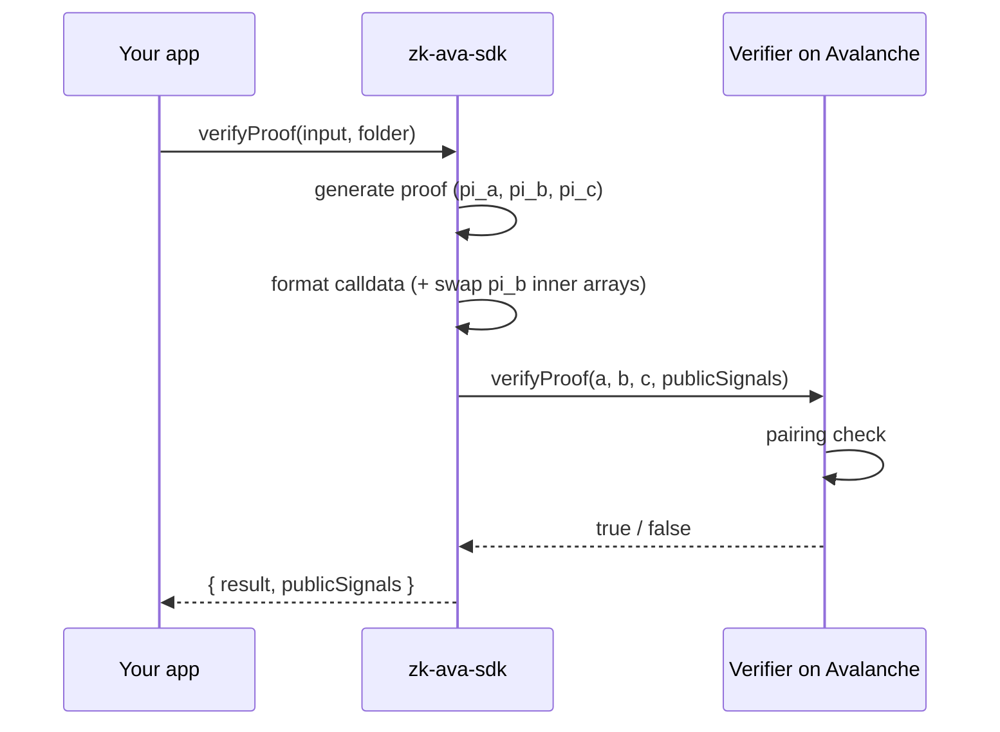

# On-chain Verification

The final piece of the puzzle: how a smart contract on Avalanche checks your proof.

## The Solidity verifier

When you `compile`, `snarkjs` exports a `verifier.sol` from your circuit's `.zkey`:

```
snarkjs zkey export solidityverifier circuit_final.zkey verifier.sol
```

This is a self-contained Solidity contract. Its verification key — the circuit-specific
parameters from the [trusted setup](groth16-trusted-setup.md) — is **hard-coded** into the
contract. That's why each circuit gets its own verifier and its own deployment.

## What the contract does

The verifier exposes a `verifyProof` function with roughly this shape:

```solidity
function verifyProof(
    uint[2] memory a,
    uint[2][2] memory b,
    uint[2] memory c,
    uint[] memory input   // public signals
) public view returns (bool);
```

Internally it computes a small, fixed number of **elliptic-curve pairings** and checks a
single equation. If the equation holds, the proof is valid for those public signals; the
function returns `true`.

Two properties make this practical on-chain:

* **Constant cost** — verification is the same handful of pairings no matter how big your
  circuit is. Avalanche's C-Chain supports the EVM precompiles (`ecAdd`, `ecMul`,
  `ecPairing`) these checks rely on.
* **`view` function** — verification reads no state and changes nothing, so calling it to
  *check* a proof (as `verifyProof()` does) costs no gas. You only pay gas to **deploy**
  the contract, or if you call it from within a state-changing transaction.

## The verification flow



## The G2 point ordering quirk

There is one detail that trips up almost everyone formatting calldata by hand, and which
the SDK handles for you: the `pi_b` point lives on the curve's **G2** group, and the
Solidity verifier expects the two coordinates of each pair in **reversed order** compared
to how `snarkjs` emits them in `proof.json`.

`zk-ava-sdk` performs this swap inside `lib/verify.js`:

```js
const pi_b = [
  [proof.pi_b[0][1], proof.pi_b[0][0]],  // inner arrays reversed
  [proof.pi_b[1][1], proof.pi_b[1][0]],
];
```

If you ever call the verifier yourself, you must do the same. See
[Proof Calldata Format](../reference/calldata.md) for the exact before/after.

## Where the deployment lives

After `deploy`, the contract address and ABI are saved to `deployment.json` in your
circuit folder. `verifyProof()` reads this file to know **which contract to call and on
which network** — you never hard-code an address. See
[Generated Artifacts](../architecture/artifacts.md).

Next: why this all runs on Avalanche → [Why Avalanche](why-avalanche.md).
