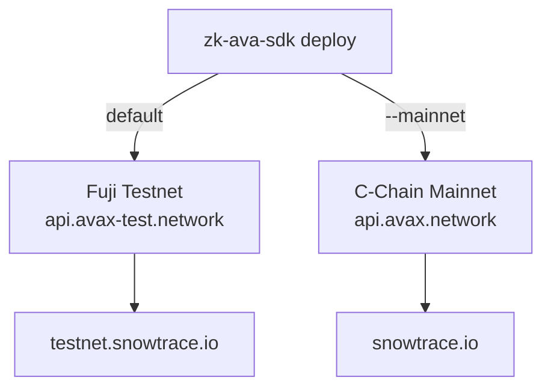

# Why Avalanche

`zk-ava-sdk` deploys and verifies on the **Avalanche C-Chain**. This page explains what
that is and why it's a good fit for on-chain ZK verification.

## The C-Chain is EVM-compatible

Avalanche runs several chains; the SDK targets the **C-Chain** (Contract Chain), which is
fully **EVM-compatible**. That means:

* The Solidity `verifier.sol` compiles and deploys exactly as it would on Ethereum.
* The elliptic-curve precompiles Groth16 verification depends on (`ecAdd`, `ecMul`,
  `ecPairing`) are available.
* Standard tooling — `solc`, `web3`, MetaMask — works without modification.

This is why the SDK can use `solc` + `web3` directly with no chain-specific adapters.

## Why it's a good fit for ZK verification

| Property | Benefit for ZK apps |
| -------- | ------------------- |
| **Low fees** | Deploying a verifier and running on-chain checks stays inexpensive. |
| **Fast finality** | Transactions finalize in ~1–2 seconds, so deploys and verifications confirm quickly. |
| **EVM compatibility** | No need to port the verifier or learn a new VM. |
| **Mature tooling** | Faucets, explorers (Snowtrace), and wallets are readily available. |

## Two networks: Fuji and mainnet

The SDK supports both Avalanche C-Chain networks:

| Network | Flag | RPC URL | Use for |
| ------- | ---- | ------- | ------- |
| **Fuji testnet** | _default_ | `https://api.avax-test.network/ext/bc/C/rpc` | Development, testing, learning (free AVAX via faucet). |
| **C-Chain mainnet** | `--mainnet` | `https://api.avax.network/ext/bc/C/rpc` | Production deployments (real AVAX). |

The chosen network and its RPC URL are persisted into `deployment.json` so that
`verifyProof()` automatically talks to the correct network without any extra configuration.


**Always start on Fuji.** It's free and identical in behavior to mainnet for these
purposes. Only deploy to mainnet once your circuit and flow are proven. See
[Deploying to Mainnet](../guides/mainnet.md).


For exact endpoints, chain IDs, faucet, and explorer links, see
[Network & RPC Details](../reference/networks.md).
