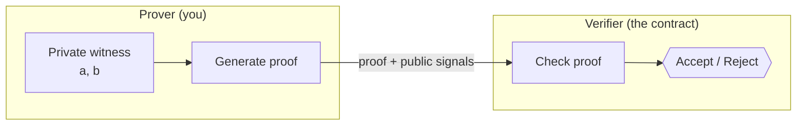

# Zero-Knowledge Proofs

This page explains the core idea behind everything `zk-ava-sdk` does. If you already know
ZKPs, skip ahead to [Groth16 & Trusted Setup](groth16-trusted-setup.md).

## The one-sentence version

A **zero-knowledge proof** lets one party (the *prover*) convince another party (the
*verifier*) that a statement is true — **without revealing why it's true**.

## A concrete example

Take the circuit used throughout these docs:

> "I know two numbers `a` and `b` such that `a * b = 33`."

A zero-knowledge proof lets you convince anyone of this statement while keeping `a` and
`b` secret. The verifier learns only that you *know* valid factors — not what they are.

* `a` and `b` are **private inputs** (the *witness*).
* `33` is a **public signal** — it's shared with the verifier.
* The proof is a small blob of data that cryptographically binds the two together.

## The three properties

A ZK proof system guarantees:

| Property | Meaning |
| -------- | ------- |
| **Completeness** | If the statement is true and you follow the protocol, the verifier always accepts. |
| **Soundness** | If the statement is false, you cannot produce a proof the verifier accepts (except with negligible probability). |
| **Zero-knowledge** | The proof reveals nothing beyond the truth of the statement — not the witness. |

## Prover and verifier

In `zk-ava-sdk`:

* **You are the prover.** The `test` command and `verifyProof()` function generate proofs
  from your inputs using the compiled circuit.
* **A smart contract is the verifier.** The `deploy` command puts a Solidity verifier on
  Avalanche; `verifyProof()` calls it to check your proof on-chain.

## Public vs. private signals

Understanding this split is essential to designing circuits:

* **Private inputs** stay on your machine. They go into proof generation but are never
  published. (In the multiplier, `a` and `b`.)
* **Public signals** are revealed to and checked by the verifier. They appear in
  `public.json` after you run `test`, and are passed to the on-chain verifier as calldata.
  (In the multiplier, the output `c`.)

The verifier contract checks that *some* valid witness exists producing those exact public
signals — without ever seeing the witness.

## zk-SNARKs

`zk-ava-sdk` uses a specific, popular family of ZK proofs called **zk-SNARKs**
(Zero-Knowledge Succinct Non-interactive ARguments of Knowledge):

* **Succinct** — proofs are tiny (a few hundred bytes) and fast to verify, which is what
  makes on-chain verification cheap enough to be practical.
* **Non-interactive** — the prover sends a single proof; no back-and-forth is needed.

The specific zk-SNARK construction used here is **Groth16** — covered next in
[Groth16 & Trusted Setup](groth16-trusted-setup.md).
