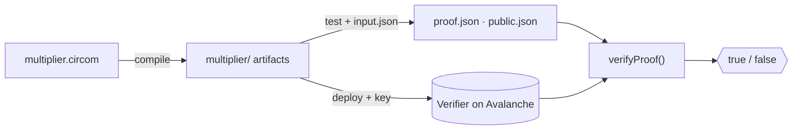

# Quick Start

This walkthrough takes you from an empty folder to a **proof verified on Avalanche** in
five steps. By the end you'll have compiled a circuit, generated a proof, deployed a
verifier contract, and checked a proof against it on-chain.


Prefer a fuller, annotated version with a concrete example and expected output? See
[Your First Circuit](../guides/first-circuit.md). This page is the fast path.


## 0. Prepare

```bash
mkdir my-zk-app && cd my-zk-app
npm init -y
npm install zk-ava-sdk
```

Make sure you have a **funded Fuji testnet wallet** — see [Prerequisites](prerequisites.md).

## 1. Write a circuit

Create `multiplier.circom` — it proves you know two factors of a product without
revealing them:

```circom
pragma circom 2.0.0;

template Multiplier() {
    signal input a;
    signal input b;
    signal output c;
    c <== a * b;
}

component main = Multiplier();
```

## 2. Compile

```bash
npx zk-ava-sdk compile multiplier.circom
```

This compiles the circuit, runs the Groth16 trusted setup, and exports a Solidity
verifier. All outputs land in a new folder named after the circuit — `./multiplier/`:

```
multiplier/
├── multiplier.r1cs
├── multiplier_js/
│   └── multiplier.wasm
├── circuit_final.zkey
└── verifier.sol
```

## 3. Test (generate a proof)

Create an `input.json` with values for your circuit's inputs:

```json
{ "a": 3, "b": 11 }
```

Then generate a proof:

```bash
npx zk-ava-sdk test ./multiplier ./input.json
```

This produces `proof.json` (the on-chain calldata) and `public.json` (the public signals)
inside `./multiplier/`.

## 4. Deploy the verifier

Deploy to **Avalanche Fuji testnet** (default):

```bash
npx zk-ava-sdk deploy ./multiplier <YOUR_PRIVATE_KEY>
```

On success you'll see the deployed contract address, and a `deployment.json` is written
into `./multiplier/` recording the address, ABI, network, and RPC URL.


Your private key pays gas. **Never commit it or paste it into shared terminals.** Prefer
an environment variable — see [Security Considerations](../help/security.md).


To deploy to **C-Chain mainnet** instead, add `--mainnet`:

```bash
npx zk-ava-sdk deploy --mainnet ./multiplier <YOUR_PRIVATE_KEY>
```

## 5. Verify a proof on-chain

Create a small script `verify.js`:

```js
const { verifyProof } = require("zk-ava-sdk");

(async () => {
  const { result, publicSignals } = await verifyProof(
    { a: 3, b: 11 },   // circuit input
    "./multiplier"      // path to the generated folder
  );

  console.log("Public signals:", publicSignals);
  console.log(result ? "✅ Valid proof" : "❌ Invalid proof");
})();
```

Run it:

```bash
node verify.js
```

`verifyProof` regenerates the proof from your input, reads the deployment info, and calls
the verifier contract on Avalanche — returning `true` for a valid proof.

## The full flow at a glance



## Where to go next

* Understand each command in depth → [CLI Reference](../cli/overview.md)
* Understand the artifacts you just generated → [Generated Artifacts](../architecture/artifacts.md)
* Learn the cryptography behind it → [Core Concepts](../concepts/zero-knowledge-proofs.md)
* Ship to production → [Deploying to Mainnet](../guides/mainnet.md)
