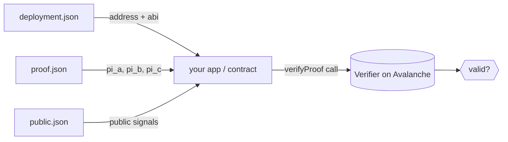

# Integrating Verification into a dApp

Once your verifier is deployed, you can verify proofs from a backend, a frontend, or even
another smart contract. This guide shows the patterns.

## Pattern 1 — Backend / Node service (recommended)

The simplest, most robust integration uses the SDK's [`verifyProof()`](../api/verify-proof.md)
directly from a Node backend. It handles proof generation, calldata formatting, and the
on-chain call for you.

```js
const express = require("express");
const { verifyProof } = require("zk-ava-sdk");

const app = express();
app.use(express.json());

app.post("/verify", async (req, res) => {
  try {
    const { result, publicSignals } = await verifyProof(req.body.input, "./multiplier");
    res.json({ valid: result, publicSignals });
  } catch (err) {
    res.status(400).json({ error: err.message });
  }
});

app.listen(3000);
```

Your frontend posts the circuit input; the backend proves and verifies. Because proving
needs the `.wasm`/`.zkey` and writes files, doing it server-side keeps secrets and tooling
off the client.


`verifyProof` writes `input.json`/`proof.json`/`public.json` into the circuit folder on each
call. For a concurrent server, serialize calls per folder or give each request an isolated
copy of the circuit folder to avoid races.


## Pattern 2 — Call the deployed contract directly

If you already have a proof and public signals, you can call the verifier yourself using
the address and ABI saved in `deployment.json`:

```js
const Web3 = require("web3");
const deployment = require("./multiplier/deployment.json");
const proof = require("./multiplier/proof.json");
const publicSignals = require("./multiplier/public.json");

const web3 = new Web3(deployment.rpcUrl);
const contract = new web3.eth.Contract(deployment.abi, deployment.contractAddress);

const pi_a = [proof.pi_a[0], proof.pi_a[1]];
const pi_b = [
  [proof.pi_b[0][1], proof.pi_b[0][0]],   // ⚠️ inner arrays reversed
  [proof.pi_b[1][1], proof.pi_b[1][0]],
];
const pi_c = [proof.pi_c[0], proof.pi_c[1]];

const valid = await contract.methods
  .verifyProof(pi_a, pi_b, pi_c, publicSignals)
  .call();
```

This is exactly what the SDK does internally. **Don't forget the `pi_b` inner-array swap** —
see [Proof Calldata Format](../reference/calldata.md).

## Pattern 3 — Verify inside another smart contract

For fully on-chain logic (e.g. only mint if a proof is valid), have your contract call the
deployed verifier. The verifier exposes:

```solidity
function verifyProof(
    uint[2] a,
    uint[2][2] b,
    uint[2] c,
    uint[] input
) external view returns (bool);
```

Your contract:

```solidity
interface IVerifier {
    function verifyProof(
        uint[2] calldata a,
        uint[2][2] calldata b,
        uint[2] calldata c,
        uint[] calldata input
    ) external view returns (bool);
}

contract Gated {
    IVerifier public immutable verifier;
    constructor(address v) { verifier = IVerifier(v); }

    function doThing(
        uint[2] calldata a,
        uint[2][2] calldata b,
        uint[2] calldata c,
        uint[] calldata input
    ) external {
        require(verifier.verifyProof(a, b, c, input), "invalid proof");
        // ... gated logic ...
    }
}
```

Pass the deployed verifier's address (from `deployment.json`) into your contract's
constructor. The caller must supply calldata with the **same `pi_b` ordering** the verifier
expects.

## Where data comes from



## Tips

* **Treat `deployment.json` as config.** It's the single source of truth for address, ABI,
  network, and RPC — commit it (it contains no secrets) so your app always targets the right
  contract.
* **`public.json` is your business data.** The public signals are what your application logic
  should branch on — they're the verified outputs of the circuit.
* **Verification is gasless off-chain.** A `view` call costs nothing; only deployment and
  in-transaction verification consume gas.
