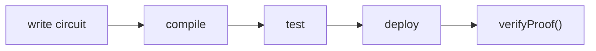

# Your First Circuit (Multiplier)

A complete, annotated walkthrough: build the classic "I know the factors" circuit, prove
it, deploy a verifier to Avalanche Fuji, and verify a proof on-chain. Budget ~10 minutes.

## What you'll build

A circuit that proves the statement:

> "I know two numbers `a` and `b` whose product is `c`" — without revealing `a` or `b`.

`a` and `b` are private; `c` is public. A verifier learns only that you know *some* valid
factors of `c`.

## Step 1 — Project setup

```bash
mkdir multiplier-demo && cd multiplier-demo
npm init -y
npm install zk-ava-sdk
```

Make sure you have a **funded Fuji wallet** (see [Prerequisites](../getting-started/prerequisites.md)).
Store the key in an environment variable so it never lands in your shell history or source:

```bash
export PRIVATE_KEY=0xyour_fuji_testnet_key
```

## Step 2 — Write the circuit

Create `multiplier.circom`:

```circom
pragma circom 2.0.0;

// Proves knowledge of two factors a, b of the public product c.
template Multiplier() {
    signal input a;   // private
    signal input b;   // private
    signal output c;  // public
    c <== a * b;
}

component main = Multiplier();
```

See [Circom & Circuits](../concepts/circom-circuits.md) for what each line means.

## Step 3 — Compile

```bash
npx zk-ava-sdk compile multiplier.circom
```

This creates `./multiplier/` containing the `.r1cs`, the `.wasm` witness calculator,
`circuit_final.zkey`, and `verifier.sol`. Expected output:

```
📦 Compiling multiplier into /…/multiplier...
✅ All files successfully generated in: /…/multiplier
```

## Step 4 — Create inputs and generate a proof

Create `input.json`:

```json
{ "a": 3, "b": 11 }
```

Generate the proof:

```bash
npx zk-ava-sdk test ./multiplier ./input.json
```

You now have `proof.json` and `public.json` in `./multiplier/`. Open `public.json` — you'll
see the public output:

```json
["33"]
```

That's `c = 3 × 11`. The verifier will check a proof produces exactly this public signal,
without ever seeing `3` or `11`.

## Step 5 — Deploy the verifier to Fuji

```bash
npx zk-ava-sdk deploy ./multiplier $PRIVATE_KEY
```

Expected output:

```
✅ Contract deployed on Avalanche fuji!
📦 Contract Address: 0x…
```

A `deployment.json` is written into `./multiplier/`. You can look up the address on the
[Fuji explorer](https://testnet.snowtrace.io/).

## Step 6 — Verify a proof on-chain

Create `verify.js`:

```js
const { verifyProof } = require("zk-ava-sdk");

(async () => {
  const { result, publicSignals } = await verifyProof(
    { a: 3, b: 11 },
    "./multiplier"
  );
  console.log("Public signals:", publicSignals); // [ '33' ]
  console.log(result ? "✅ Valid proof" : "❌ Invalid proof");
})();
```

Run it:

```bash
node verify.js
```

You should see `✅ Valid proof`. The SDK regenerated a proof from your input, formatted the
calldata (including the G2 `pi_b` swap), and called your deployed contract — returning
`true`.

## Step 7 — Prove it actually means something

Try changing the input so it no longer matches what makes sense for your application logic,
or tamper with `proof.json` by hand, and re-run. A genuine ZK system only accepts proofs
that satisfy the circuit's constraints — this is the **soundness** property from
[Zero-Knowledge Proofs](../concepts/zero-knowledge-proofs.md).

## What you learned



* Private vs public signals in practice.
* The four-step pipeline end to end.
* How `verifyProof()` ties off-chain proving to on-chain verification.

## Where to go next

* Use real cryptographic primitives → [Using circomlib Components](circomlib.md)
* Ship to production → [Deploying to Mainnet](mainnet.md)
* Call the verifier from a frontend → [Integrating Verification into a dApp](dapp-integration.md)
