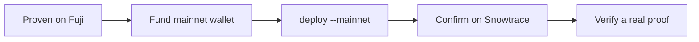

# Deploying to Mainnet

When your circuit and flow are proven on Fuji, you can promote the verifier to the
**Avalanche C-Chain mainnet** with a single flag. This guide covers the differences and a
safe promotion checklist.

## The one change

Add `--mainnet` to the deploy command:

```bash
# Testnet (Fuji) — what you've been using
npx zk-ava-sdk deploy ./multiplier $PRIVATE_KEY

# Mainnet (C-Chain)
npx zk-ava-sdk deploy --mainnet ./multiplier $PRIVATE_KEY
```

Everything downstream adapts automatically: the SDK writes `network: "mainnet"` and the
mainnet RPC URL into `deployment.json`, and [`verifyProof()`](../api/verify-proof.md) reads
that file — so your verification code needs **no changes**.

## What's different on mainnet

| | Fuji testnet | C-Chain mainnet |
| --- | --- | --- |
| Gas paid in | Free test AVAX (faucet) | **Real AVAX** |
| RPC URL | `api.avax-test.network` | `api.avax.network` |
| Explorer | [testnet.snowtrace.io](https://testnet.snowtrace.io/) | [snowtrace.io](https://snowtrace.io/) |
| Audience | You and testers | Real users / real value |

See [Network & RPC Details](../reference/networks.md) for exact endpoints.

## Promotion checklist



1. **Prove it on Fuji first.** Compile, test, deploy, and verify on testnet until the flow
   is solid. Mainnet behaves identically — there are no surprises if Fuji works.
2. **Audit the circuit.** A deployed verifier is only as trustworthy as the circuit it was
   built from. Make sure the constraints actually capture your intended statement.
3. **Mind the trusted setup.** The bundled `pot12_final.ptau` carries a trust assumption.
   For high-value mainnet use, consider supplying a ptau from a ceremony you trust — see
   [Groth16 & Trusted Setup](../concepts/groth16-trusted-setup.md) and
   [Security Considerations](../help/security.md).
4. **Fund the deploying wallet** with enough real AVAX for deployment gas.
5. **Protect the key.** Use an environment variable or secrets manager; never commit it.
6. **Deploy** with `--mainnet`, then confirm the address on
   [snowtrace.io](https://snowtrace.io/).
7. **Verify a real proof** end-to-end against the mainnet contract before relying on it.

## After deployment

* `deployment.json` now points at mainnet. Keep separate folders (or back up the file) if
  you want to retain both a Fuji and a mainnet deployment of the same circuit.
* Verification is a `view` call, so checking proofs costs no gas — only the initial deploy
  did.


Once deployed, the verifier is immutable. If you change the circuit, you must re-`compile`
and re-`deploy` to get a new verifier at a new address. Plan your circuit before mainnet.


## Next

* Use the deployment from a frontend or contract → [Integrating Verification into a dApp](dapp-integration.md)
