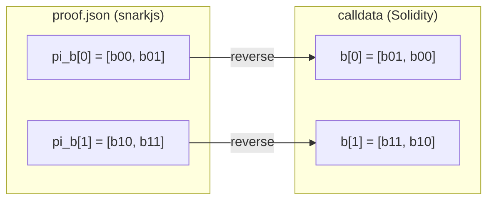

# Proof Calldata Format

To verify a Groth16 proof on-chain you must pass it to the Solidity verifier in the exact
shape it expects. The SDK does this for you inside [`verifyProof()`](../api/verify-proof.md);
this page documents the format for anyone calling the contract directly.

## The verifier signature

The generated `verifier.sol` exposes:

```solidity
function verifyProof(
    uint[2]    a,      // pi_a
    uint[2][2] b,      // pi_b  (a G2 point)
    uint[2]    c,      // pi_c
    uint[]     input   // public signals
) public view returns (bool);
```

## What's in `proof.json`

`snarkjs` writes the proof as three points:

```json
{
  "pi_a": ["a0", "a1", "1"],
  "pi_b": [["b00", "b01"], ["b10", "b11"], ["1", "0"]],
  "pi_c": ["c0", "c1", "1"],
  "protocol": "groth16",
  "curve": "bn128"
}
```

Only the first two elements of `pi_a` and `pi_c`, and the first two coordinate-pairs of
`pi_b`, are used. The trailing projective `"1"`/`"0"` elements are dropped.

## The mapping (with the G2 swap)

The crucial subtlety: `pi_b` is a point on the **G2** group, and the Solidity verifier
expects the two components of **each** coordinate pair in **reversed order** relative to how
`snarkjs` emits them.

```js
const pi_a = [proof.pi_a[0], proof.pi_a[1]];

const pi_b = [
  [proof.pi_b[0][1], proof.pi_b[0][0]],   // ⚠️ inner pair reversed
  [proof.pi_b[1][1], proof.pi_b[1][0]],   // ⚠️ inner pair reversed
];

const pi_c = [proof.pi_c[0], proof.pi_c[1]];

const publicSignals = require("./public.json"); // passed as-is
```

This is exactly what `lib/verify.js` does.

### Before vs after for `pi_b`

| | Element `[0]` | Element `[1]` |
| --- | --- | --- |
| `proof.pi_b[0]` (snarkjs) | `b00` | `b01` |
| **calldata `b[0]`** (verifier) | `b01` | `b00` |
| `proof.pi_b[1]` (snarkjs) | `b10` | `b11` |
| **calldata `b[1]`** (verifier) | `b11` | `b10` |




Forgetting the `pi_b` swap is the #1 reason a valid proof fails on-chain. `pi_a` and `pi_c`
are **not** swapped — only `pi_b`'s inner arrays.


## Public signals

`public.json` is an array of decimal strings and is passed straight through as the `input`
argument — no transformation:

```json
["33"]
```

The order and count must match what the circuit (and thus the verifier) expects.

## Calling it

```js
const valid = await contract.methods
  .verifyProof(pi_a, pi_b, pi_c, publicSignals)
  .call();   // view call — no gas
```

## See also

* [verifyProof](../api/verify-proof.md) — the function that does all of this for you.
* [On-chain Verification](../concepts/onchain-verification.md) — what the verifier checks.
* [Integrating Verification into a dApp](../guides/dapp-integration.md) — calling it yourself.
