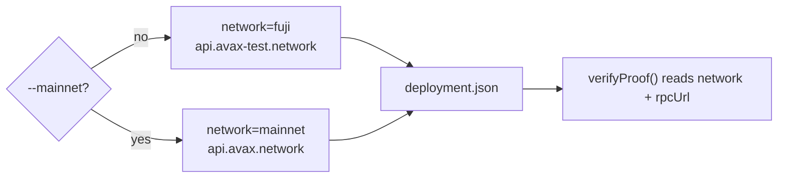

# Network & RPC Details

`zk-ava-sdk` deploys to and verifies on the **Avalanche C-Chain**. It supports two
networks, selected by the [`deploy --mainnet`](../cli/deploy.md) flag.

## Endpoints

| Network | Default? | RPC URL | Chain ID |
| ------- | -------- | ------- | -------- |
| **Fuji testnet** | ✅ yes | `https://api.avax-test.network/ext/bc/C/rpc` | `43113` |
| **C-Chain mainnet** | via `--mainnet` | `https://api.avax.network/ext/bc/C/rpc` | `43114` |

These exact RPC URLs are what the SDK hard-codes in `lib/deploy.js` and falls back to in
`lib/verify.js`.

## Explorers & faucet

| Resource | Fuji | Mainnet |
| -------- | ---- | ------- |
| Block explorer | [testnet.snowtrace.io](https://testnet.snowtrace.io/) | [snowtrace.io](https://snowtrace.io/) |
| Faucet (free AVAX) | [faucet.avax.network](https://faucet.avax.network/) | — |

Use the explorer to confirm a deployment (look up the address from `deployment.json`) and to
inspect the deploying transaction.

## How the network is chosen and persisted

1. `deploy` picks the network from the `--mainnet` flag (default = Fuji).
2. It writes both `network` and `rpcUrl` into `deployment.json`.
3. `verifyProof()` reads `rpcUrl` from that file. If `rpcUrl` is missing, it derives the URL
   from `network` (`mainnet` → `api.avax.network`, otherwise → `api.avax-test.network`).

This is why you never pass an RPC URL or network to `verifyProof` — it's already recorded at
deploy time.

## Using a custom RPC

The SDK uses public Avalanche RPC endpoints by default. If you operate your own node or use
a provider, you can point verification at it by editing the `rpcUrl` field in
`deployment.json` after deployment — `verifyProof()` honors whatever URL is stored there.


Public RPC endpoints can rate-limit under heavy use. For production traffic, consider a
dedicated RPC provider and set its URL in `deployment.json`.


## See also

* [`deploy`](../cli/deploy.md) — how deployment targets a network.
* [Why Avalanche](../concepts/why-avalanche.md) — why the C-Chain.
* [Deploying to Mainnet](../guides/mainnet.md) — promoting from Fuji to mainnet.
